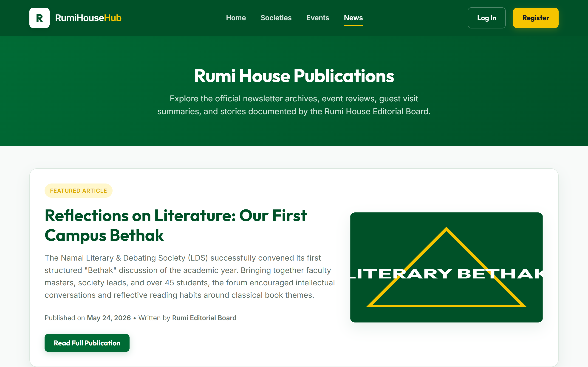

# Rumi House Hub — WAD Assignment 1

A centralized student co-curricular engagement portal for **Rumi House** at Namal University, Mianwali.  
Built with **pure HTML5** and a single **external CSS3** style sheet — engineered without frameworks or JavaScript logic to build a responsive, accessible, and elegant visual prototype.

---

## 🎓 Academic Details

| Field | Detail |
| :--- | :--- |
| **Course** | Web Application Development (WAD) — CS-370 |
| **Institution** | Namal University, Mianwali |
| **Instructor** | Ammar Ahmad Khan |
| **Student Name** | Abu Bakar |
| **Roll Number** | NUM-BSCS-2022-41 |
| **Phase / Assignment** | Assignment 1 — Pure HTML & CSS Static Prototype |

---

## 🎨 Brand Color Sourcing & Academic Honesty

The visual system is designed around a **Namal-inspired academic branding palette** optimized for clean, high-contrast readability. 

To maintain academic honesty:
* The gold accent color (`#f5c400` / `#d9a900`) and green primary accents (`#006b35` / `#005128`) are **project-level custom selections** designed to visually harmonize with your existing Namal GPA Calculator styling and the university's environmental and co-curricular spirit. They are not represented as verified official brand colors.
* All layout surfaces, white card spaces, and soft moss shadows are tailored to deliver a cohesive, modern, and highly professional student-council dashboard feel.

---

## 📸 Visual Previews (New Retaken Screenshots)

The portal views have been captured to display the light-mode green and gold academic branding styles:

### 1. Landing Portal Hero (`index.html`)


### 2. Clubs & Societies Directory (`societies.html`)


### 3. Events Timeline Calendar (`events.html`)


### 4. Society Profile Detail — NEC (`society-detail.html`)


### 5. Event Specifications & Mock RSVP (`event-detail.html`)


### 6. Newsletter & Publications Archives (`news.html`)


---

## 🚀 Key Implemented Features

### 📋 Page Directory Structure
The Assignment 1 static prototype is organized into **six complete web pages** fully cross-linked:
1. **Home (`index.html`)**: Features a clean green hero banner with gold CTA buttons, followed by Rumi House core vision text, metric cards, and a preview of recent publications.
2. **Societies (`societies.html`)**: A comprehensive directory listing cards for all **5 Rumi House internal clubs** and **6 major university societies** using responsive CSS grids.
3. **Society Detail (`society-detail.html`)**: Dedicated sample profile for the *Namal Environmental Club* (NEC) listing objectives, executive body roles using **neutral coordinator labels**, and upcoming events.
4. **Events (`events.html`)**: A vertical chronological timeline organizing upcoming activities (Sports Gala, Literary Night, Debate Workshop, Meetup) and past events.
5. **Event Detail (`event-detail.html`)**: In-depth review of the *Annual Inter-House Sports Gala* showcasing venue specifications, a CSS registration tracker bar, and a mock QR attendance check-in card showing fallback token `RUMI-8893-X`.
6. **News (`news.html`)**: Magazine layout showcasing newsletter archives, alerts, and Rumi editorial board descriptions.
7. **Auxiliary skeletons (`login.html` & `register.html`)**: Auth panels validating email domains (`@namal.edu.pk` matches) and registration number patterns.

### 🎨 Semantic Markup & Clean Styling (CSS3 Box Model)
* Designed utilizing strict HTML5 semantic structural tags (`<header>`, `<nav>`, `<main>`, `<section>`, `<article>`, `<aside>`, `<footer>`).
* Maintained total separation of concerns using a single external style sheet (`styles.css`) configured with dynamic root CSS variables.
* Demonstrated rigorous CSS Box Model applications (`margin`, `padding`, `border`, `width`, `height`, and `box-sizing: border-box`).

### 📱 Grid / Flexbox Layouts & Responsiveness
* **Flexbox Rules**: Power the navigation headers, brand logos, specifications cells, and structured footer lists.
* **CSS Grid Rules**: Power the societies directories, spotlight hero sections, and newsletter layouts.
* **Media Breakpoints**: Custom responsive queries at `768px` and `992px` ensure grid decks stack smoothly, preventing any horizontal scrolling down to 375px mobile viewports.

---

## 📁 File Structure

```text
Assignment-1_Rumi-House-Hub/
├── index.html                     # Central landing page
├── societies.html                 # Societies grid directory
├── society-detail.html            # Namal Environmental Club profile
├── events.html                    # Chronological events calendar
├── event-detail.html              # Inter-House Sports Gala details
├── news.html                      # Rumi newsletter archives
├── login.html                     # Auth credential mock page
├── register.html                  # Account registration mock page
├── styles.css                     # Central CSS style sheet
├── WAD_Assignment1_Report.docx    # Word document report
├── README.md                      # This documentation file
├── media/                         # Local SVGs, lightweight assets
└── screenshots/
    ├── 01_header_hero.png         # Screenshot of Home Landing page
    ├── 02_about_societies.png     # Screenshot of Societies Directory
    ├── 03_events_table.png        # Screenshot of Events timeline
    ├── 04_registration_form.png   # Screenshot of Club Profile Detail
    ├── 05_multimedia_footer.png   # Screenshot of Event Specifications
    └── 06_news_archive.png        # Screenshot of News Archives page
```

---

## 🛠️ How to Open & Test Locally

1. Open the project directory in your local filesystem.
2. Double-click the `index.html` file to open it instantly in any web browser.
3. Use the header menu or action buttons to navigate seamlessly across all pages.
4. Scale your browser window or use DevTools simulation to verify mobile-responsive card stacking.
