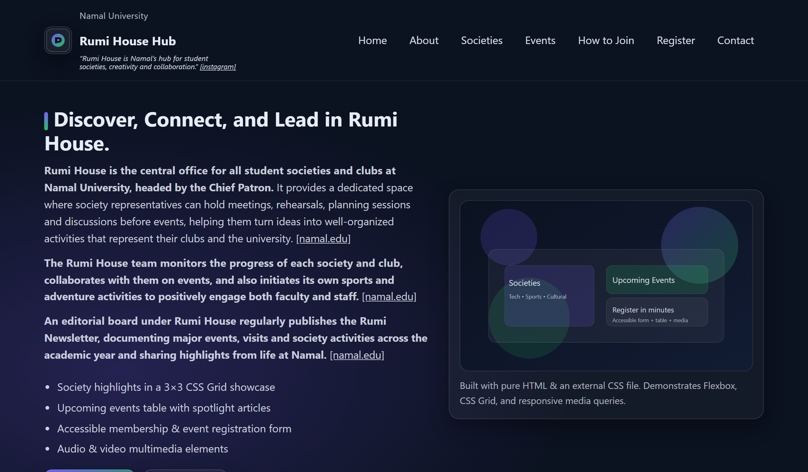
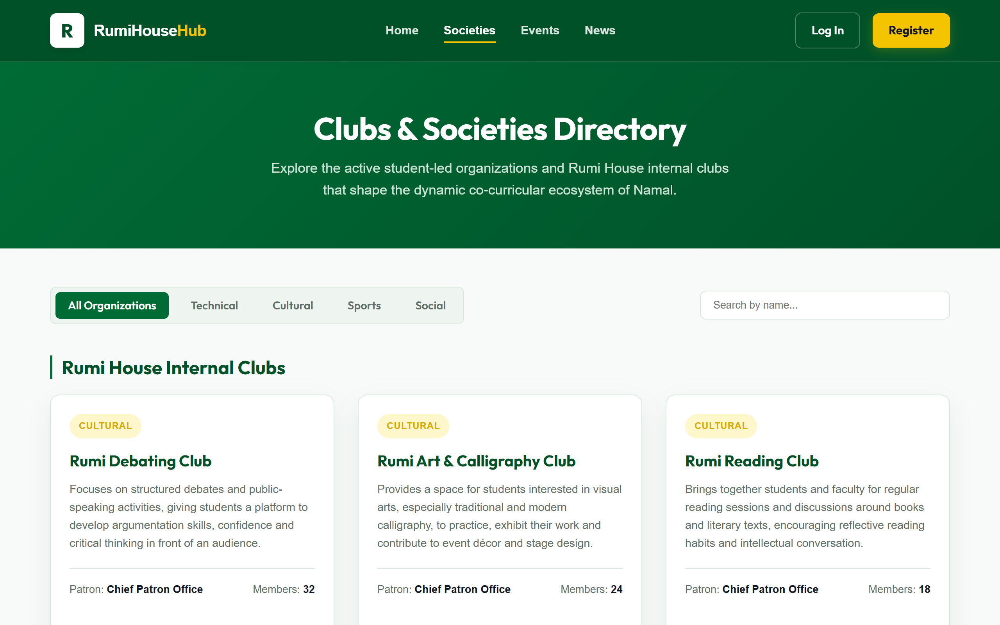
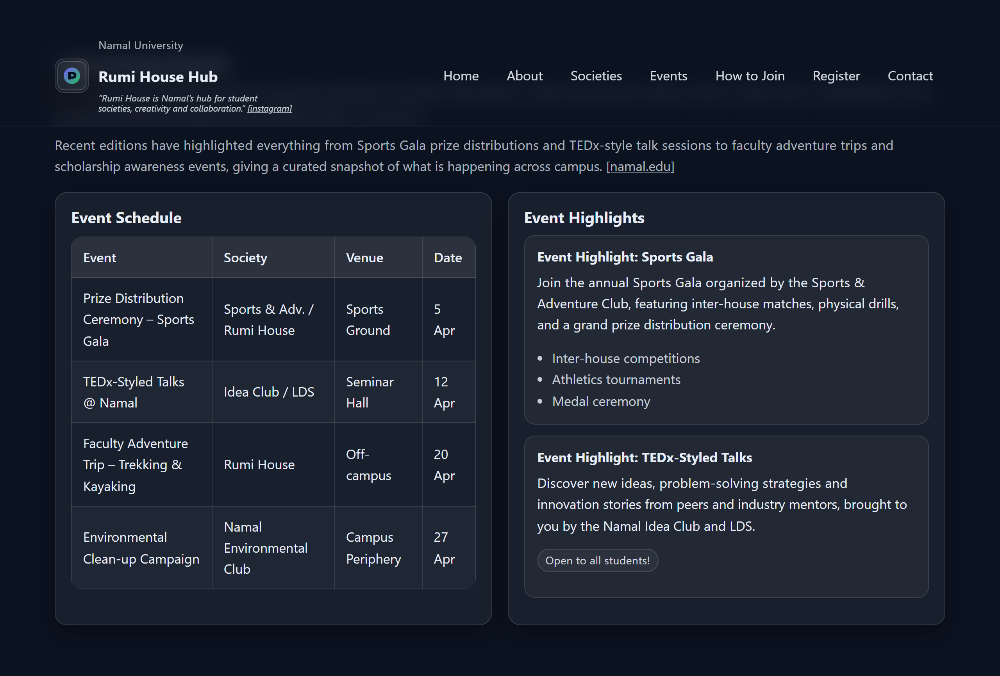
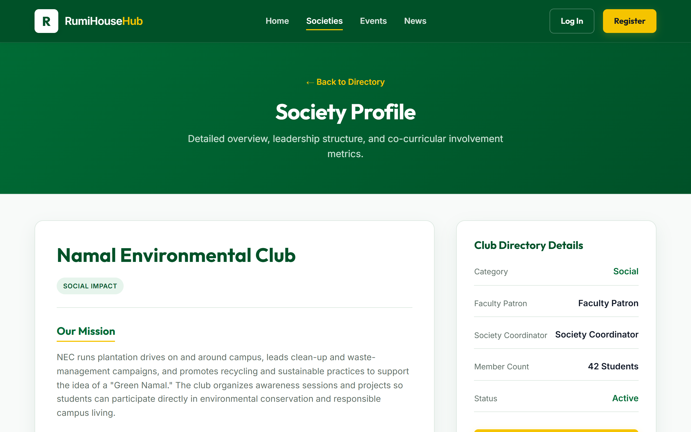
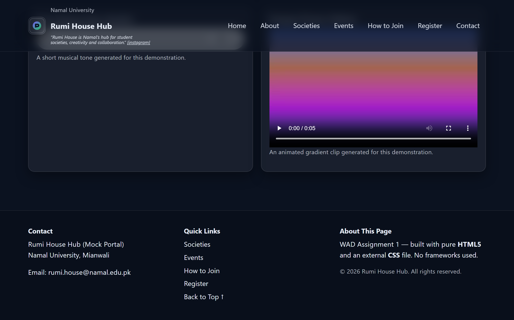

# Rumi House Hub — WAD Assignment 1

A student engagement portal for **Rumi House** at Namal University, Mianwali.  
Built with **pure HTML5** and an **external CSS** file — no frameworks or JavaScript.

---

## 🎓 Academic Details

| Field | Detail |
|---|---|
| **Course** | Web Application Development (WAD) |
| **Department** | Department of Computer Science |
| **Institution** | Namal University, Mianwali |
| **Instructor** | Ammar Ahmad Khan |
| **Student Name** | Abu Bakar |
| **Roll Number** | NUM-BSCS-2022-41 |
| **Due Date** | 20-March-2026 |

---

## 📸 Visual Previews

### 1. Header & Hero Section


### 2. About Me & Societies 3x3 Grid


### 3. Events Schedule Table & Spotlight


### 4. Membership / Registration Form


### 5. Multimedia Player & Footer


---

## 🚀 Key Implemented Features

### 📋 Task 1 — HTML Structure
- Semantic HTML5 tags utilized throughout (`<header>`, `<nav>`, `<main>`, `<section>`, `<article>`, `<footer>`, `<figure>`, `<address>`).
- Complete `<head>` meta configuration including `charset`, `viewport`, `description`, and `keywords`.
- Strict heading hierarchy (`h1`–`h4`), clear paragraphs, descriptive alt texts for images, and standard keyboard-accessible anchor links.

### ⚙️ Task 2 — Content Elements
- **Membership Form**: Implemented all **8 required input types** (`text`, `email`, `password`, `checkbox`, `radio`, `date`, `file`, `submit`) with clean accessible `<label>` wrappers and styled grids.
- **Events Table**: A fully structured table featuring `<thead>`, `scope="col"` attributes, and `<time>` tags for machine-readable dates.
- **Lists**:
  - *Ordered List*: A 6-step roadmap detailing "Steps to Register".
  - *Unordered List*: A 6-item list summarizing the "Benefits of Joining Societies".
- **Multimedia Controls**: Built-in native `<audio>` and `<video>` tags referencing local WAV and MP4 samples with modern controls and fallback messages.
- **Accessibility features**: Associated label tags, ARIA attributes, semantic markup, and a fully functional "Skip-to-content" bypass link.

### 🎨 Task 3 — CSS Styling & Box Model
- Full separation of concerns using an **external stylesheet** (`styles.css`).
- Utilization of diverse selector patterns: element selectors, custom class definitions, unique ID references, grouping rules, pseudo-classes (`:hover`, `:focus-visible`, `:nth-child`), and pseudo-elements (`::before`, `::first-line`).
- Rigorous demonstration of the **CSS Box Model** utilizing `margin`, `padding`, `border`, `width`, `height`, and `box-sizing: border-box`.

### 📱 Task 4 — Layout & Responsiveness
- **Flexbox Layouts**: Used to align navigation links, structure header bars, organize two-column schedules, and distribute footer columns.
- **CSS Grid Layouts**: Implemented for the 3×3 society showcases, hero layout splits, and side-by-side form controls.
- **Media Queries**: Fully responsive layouts operating smoothly across three custom breakpoints:
  - `Mobile` (≤ 600px): Stacked structures and optimized text sizing.
  - `Tablet` (601px - 991px): Hybrid columns and customized forms.
  - `Desktop` (≥ 992px): Multi-column grids and wide displays.

---

## 📁 File Structure

```text
Assignment-1_Rumi-House-Hub/
├── index.html                     # Core HTML webpage
├── styles.css                     # External CSS styles
├── WAD_Assignment1_Report.docx    # Word document report
├── README.md                      # This documentation file
├── media/
│   ├── logo.svg                   # Brand Hexagon Logo
│   ├── hero.svg                   # Hero Illustration
│   ├── rumi-intro.wav             # WAV Audio Sample (5s)
│   └── rumi-tour.mp4              # MP4 Video Sample (5s)
└── screenshots/
    ├── 01_header_hero.png         # Screenshot of the Hero Section
    ├── 02_about_societies.png     # Screenshot of the 3x3 Grid
    ├── 03_events_table.png        # Screenshot of the Event Table
    ├── 04_registration_form.png   # Screenshot of the Form Fields
    └── 05_multimedia_footer.png   # Screenshot of the Audio/Video & Footer
```

---

## 🛠️ How to Run Locally

1. Open the project folder in your filesystem.
2. Double-click the `index.html` file to open it directly in any modern web browser.
3. No server or compilation steps required — pure, standard HTML5 & CSS3.
