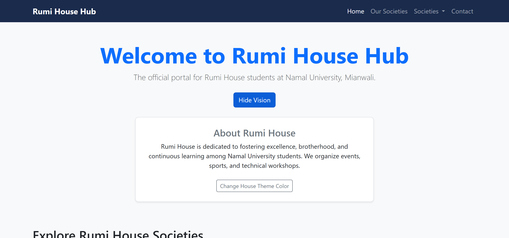
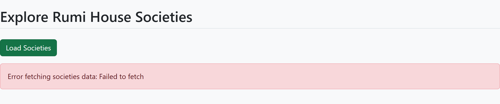
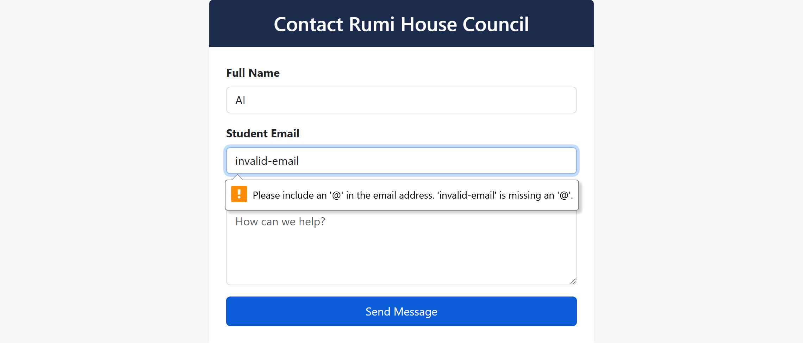

# Rumi House Hub — WAD Assignment 2

An interactive student engagement portal for **Rumi House** at Namal University, Mianwali.  
Upgraded from static HTML5/CSS3 to a fully interactive and responsive web application leveraging **Bootstrap 5**, **Vanilla JavaScript (ES6+)**, and **Asynchronous API data fetching**.

---

## 🎓 Academic Details

| Field | Detail |
|---|---|
| **Course** | Web Application Development (WAD) |
| **Department** | Department of Computer Science |
| **Institution** | Namal University, Mianwali |
| **Instructor** | Ammar Ahmad Khan |
| **Student Name** | Abu Bakar |
| **Roll Number** | NUM-BSCS-2022-41 |
| **Due Date** | 03-May-2026 |

---

## 📸 Visual Previews

### 1. Bootstrap Header & Toggled Vision Block


### 2. Dynamically Rendered Cards via Fetch API


### 3. JavaScript Form Validation Error States


---

## 🚀 Key Implemented Features

### 📦 Task 1: Bootstrap Setup & Grid Integration
- **Bootstrap 5 Setup**: Successfully integrated Bootstrap 5 via stable CDN links for both responsive CSS rules in the `<head>` and the JS Bundle right before the closing `</body>` tag.
- **Responsive Layout**: Designed with responsive grid classes (`.col-12`, `.col-md-6`, `.col-lg-4`) ensuring optimal display adaptations on mobile phones, tablets, and desktop workstations.

### 🎨 Task 2: UI Design & Bootstrap Components
- **Responsive Navigation**: Implemented an expandable `.navbar-expand-lg` header featuring a functional brand, link sequences, dropdown folders, and a native hamburger toggler for mobile users.
- **Styled Cards & Buttons**: Structured the main interactive components inside shadowed `.card` containers and integrated multiple distinct button styles matching their relative visual weights (`.btn-primary`, `.btn-success`, `.btn-outline-primary`).

### ⚙️ Task 3: Forms & Customized Styling
- **Uniform Input Controls**: Designed an accessible contact form styling name, email, and description fields using Bootstrap's native `.form-control` and `.form-label` properties.
- **Custom Branding**: Developed an external `style.css` override declaring a primary deep navy blue theme (`.rumi-bg-dark` / `#1a2b4c`) representing Rumi House branding, alongside warning styling (`.error-text`) for user validation.

### 🧠 Task 4: JavaScript Logic & State Management
- **Variables & Scopes**: Applied modern variable declarations (`const` for stable DOM references/static lists, `let` for reactive layout states).
- **Data Types**: Demonstrated usage of multiple native JS data structures including Strings, Arrays (for hex color lists), Booleans (validity checks), and structured Objects (dynamic JSON data).
- **Control Flow**: Managed system operations using strict equality checking (`===`), logical conjunctions (`&&`), negations (`!`), standard conditional structures (`if-else`), and modern iterator loops (`.forEach`).

### 🖱️ Task 5: DOM Manipulation & Event Handlers
- **Event Listeners**: Separated script rules clean from markup components by wiring actions exclusively using `.addEventListener()` hooks.
- **Reactive UI Changes**: Clicking the "Discover Our Vision" button triggers dynamic style modifications by switching CSS display modes between `none` and `block`, while simultaneously updating button action texts.
- **Form Control**: Intercepts form submissions using `preventDefault()`, analyzing values, and dynamically rendering targeted validation messages underneath input fields.

### ⚡ Task 6: Modern ES6+ Syntax & Theme Customizer
- **Modern Syntaxes**: Clean codebase entirely free of deprecated `var` and `function` tags. Arrow functions `() => {}` are used for all callbacks, and template literals (backticks + `${}`) drive string building.
- **Theme Randomizer**: Built a live color customizer clicking the "Change House Theme Color" button. It picks a random index from a custom Hex color array using `Math.random()` and applies the styling dynamically via the `element.style.backgroundColor` DOM attribute.

### 🌐 Task 7: Asynchronous API & Error Handling
- **API Fetching**: Loaded campus society cards asynchronously from a local `data.json` database file using the standard `fetch()` API and `async/await` syntax.
- **Asynchronous States**: Displays a responsive Bootstrap `.spinner-border` loading indicator during active database connection requests and hides it upon render.
- **Defensive Error Handling**: Wrapped the API pipeline inside a safe `try...catch` block. If file loads fail, the system safely catches the exception and prints a clean Bootstrap `.alert-danger` banner to protect the UI.

---

## 📁 File Structure

```text
Assignment-2_Rumi-House-Hub/
├── index.html                  # Core HTML structure
├── style.css                   # Overriding custom CSS
├── script.js                   # Application interactivity logic
├── data.json                   # Local data storage database
├── Assignment_2_Report.docx    # Word document report
├── README.md                   # This documentation file
└── screenshots/
    ├── 01_header_navbar_vision.png  # Header navigation and collapsed panel
    ├── 02_dynamic_societies.png     # Rendered cards loaded from JSON
    └── 03_contact_validation.png    # Validation error responses
```

---

## 🛠️ How to Run Locally

1. Ensure all files (`index.html`, `style.css`, `script.js`, `data.json`) are stored together in the same directory.
2. Double-click the `index.html` file to open it in a modern browser (Chrome, Edge, Firefox).
3. To view the dynamic JSON fetching feature:
   - Since modern browsers block local `fetch()` calls from `file:///` URLs due to CORS policies, run the folder using a local development server (like VS Code's **Live Server** extension, or `npx serve .`, or python's `python -m http.server`).
   - Click the **"Load Societies"** button to fetch and render the cards dynamically!
