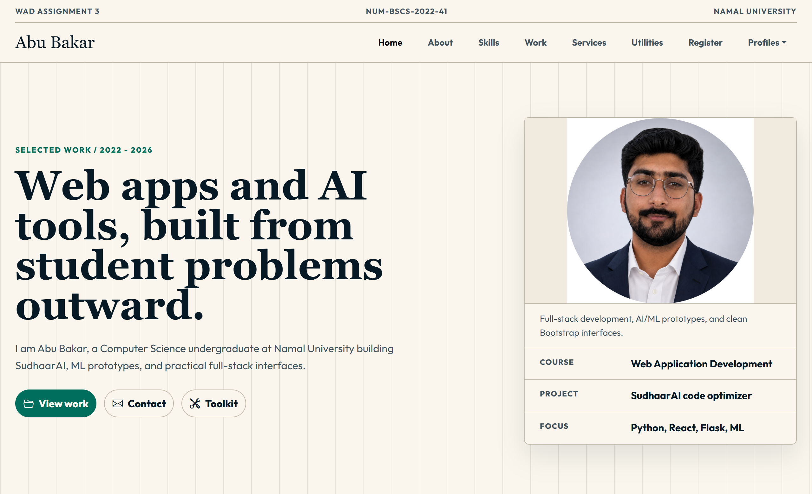
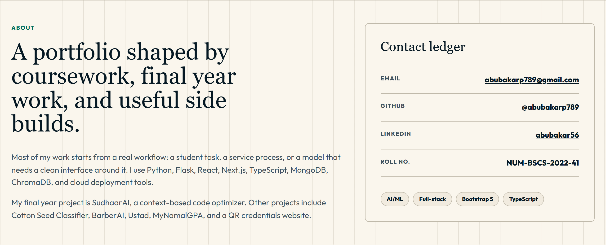
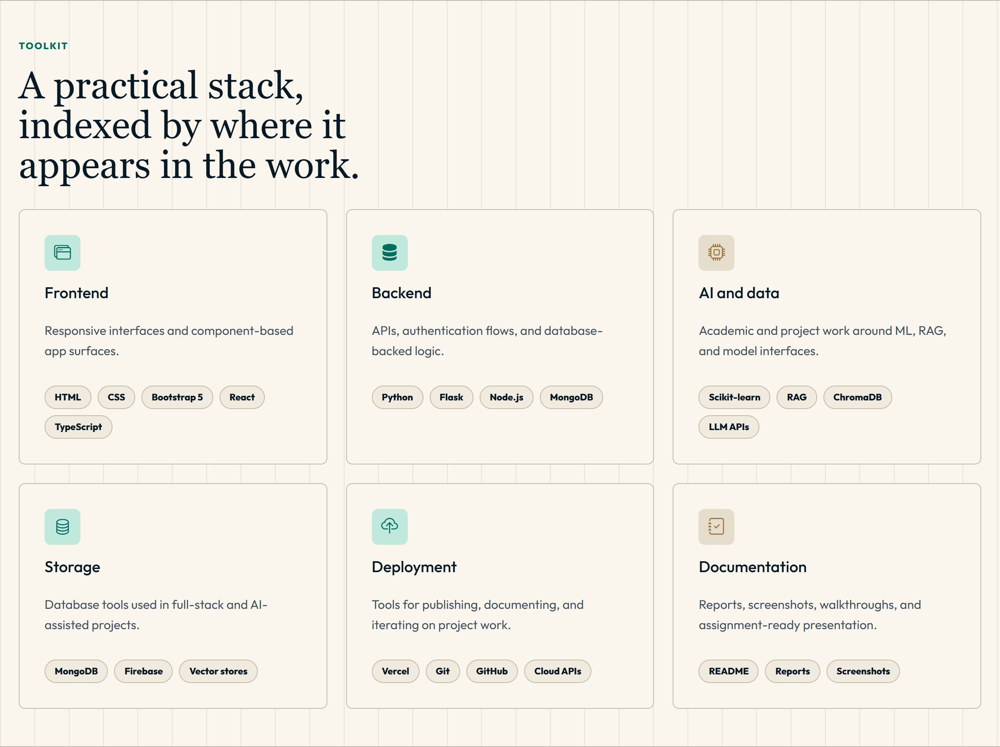
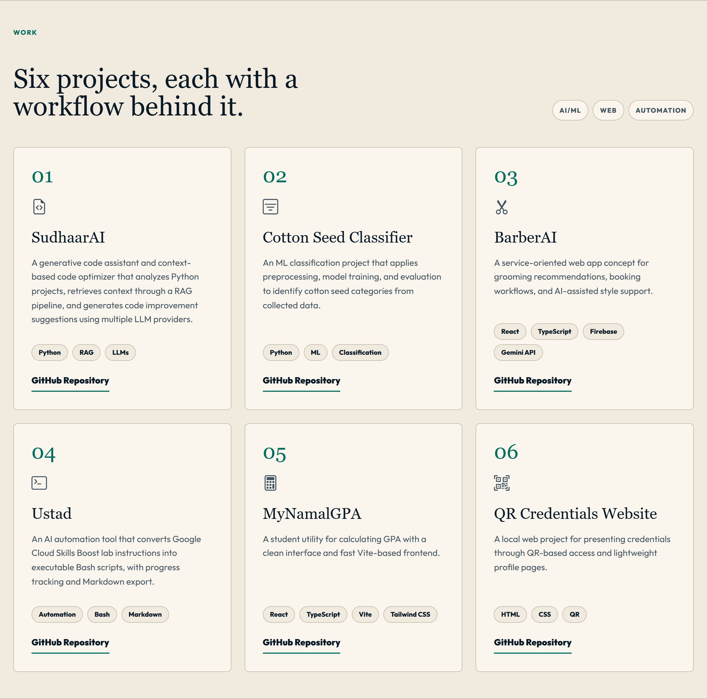
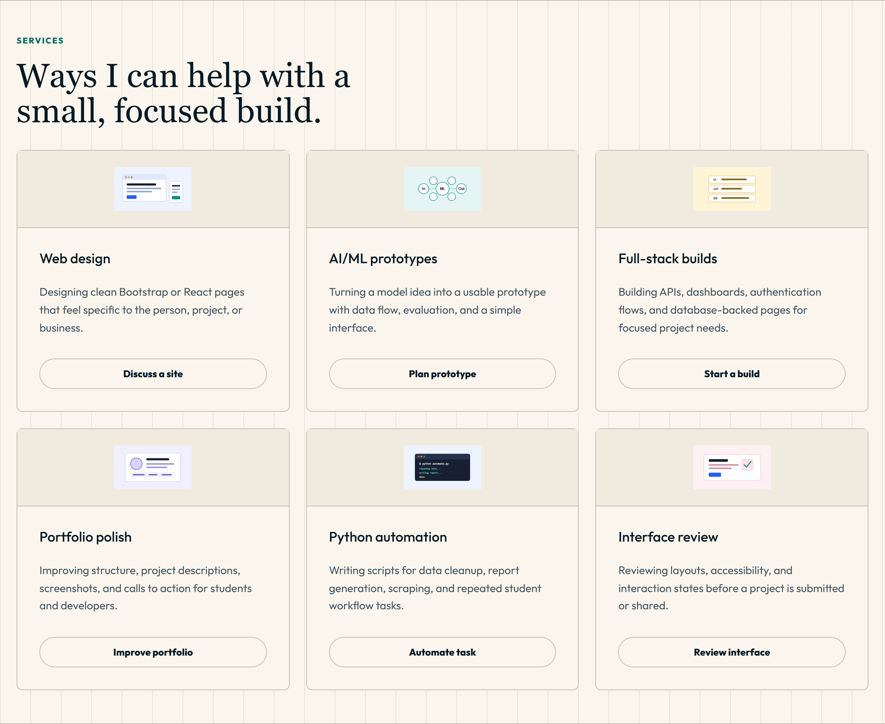
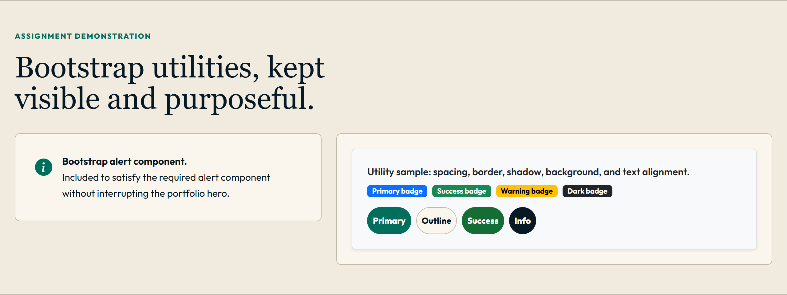
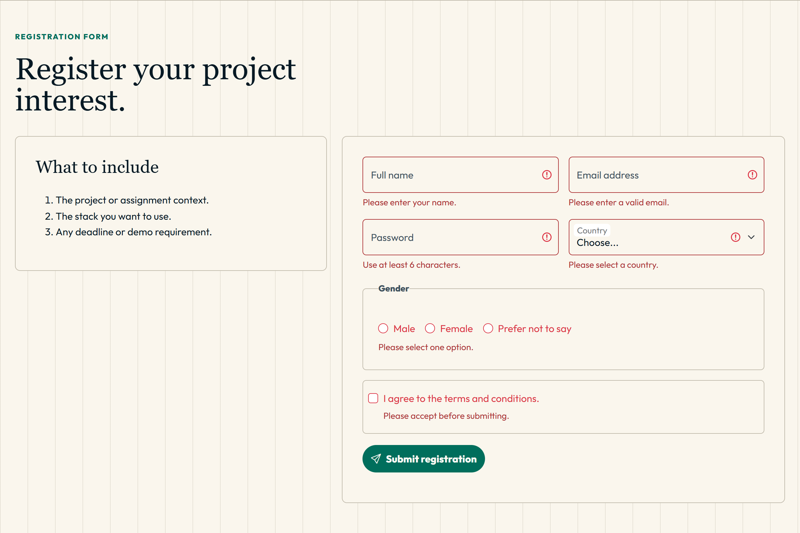
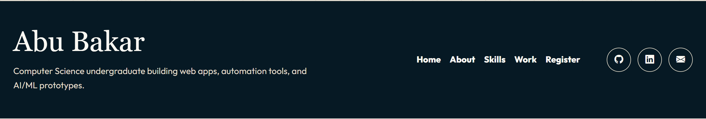

# Abu Bakar - Bootstrap Portfolio Assignment

Web Application Development (WAD) - Assignment 3  
Theme chosen: Personal Portfolio Website

This project is a fully responsive Bootstrap 5 portfolio website for Abu Bakar. It demonstrates the required Bootstrap layout, navigation, UI components, registration form, utilities, responsive card sections, and custom styling requested in Assignment 3.

## Student Details

| Field | Detail |
|---|---|
| Institution | Namal University, Mianwali |
| Department | Computer Science |
| Course | Web Application Development |
| Assignment | Assignment 3 |
| Instructor | Ammar Ahmad Khan |
| Due Date | 14-June-2026 |
| Student Name | Abu Bakar |
| Roll Number | NUM-BSCS-2022-41 |
| Website Theme | Personal Portfolio |

## Assignment Requirements Covered

### Task 1: Bootstrap Setup and Responsive Layout

- Bootstrap 5 is integrated through CDN.
- The page includes a header, main content area, sidebar-style profile/about content, and footer.
- Bootstrap grid classes are used throughout the layout.
- The design adapts across mobile, tablet, and desktop screen sizes.

### Task 2: Navigation and UI Components

- Responsive navbar with brand/logo, links, dropdown menu, and mobile collapse toggler.
- Bootstrap buttons using multiple styles, including primary, outline, success, and info.
- Bootstrap cards for projects, services, skills, and profile content.
- Badges are used for tools, technologies, and labels.
- Bootstrap alerts are included in the utilities section and form validation success state.

### Task 3: Forms and Input Controls

- Registration form includes full name, email address, password, gender selection, country selection, and terms checkbox.
- Fields use Bootstrap form classes and grid layout.
- Validation feedback is shown with Bootstrap validation styling.

### Task 4: Bootstrap Utilities

- A dedicated utilities section demonstrates spacing, text alignment, background colors, text colors, borders, shadows, and display utilities.

### Task 5: Responsive Content Section

- Services section contains 6 responsive cards.
- Each service card includes an image, title, description, and button.
- Cards automatically adjust according to screen size using Bootstrap grid columns.

### Task 6: Bootstrap Customization

- Custom CSS is included in `style.css`.
- Navbar colors, buttons, cards, hover effects, typography, spacing, and responsive behavior are customized beyond default Bootstrap styling.

### Task 7: Mini Website Development

- The final website is a complete personal portfolio.
- It includes hero, about, skills, projects, services, utilities, registration form, and footer sections.
- The interface is designed to be consistent, modern, and responsive.

## Screenshots

### 1. Desktop Hero Section



### 2. About Section and Sidebar



### 3. Technical Skills



### 4. Project Cards



### 5. Services Cards



### 6. Bootstrap Utilities Showcase



### 7. Registration Form Validation



### 8. Footer Details



## Project Structure

```text
Bootstrap-Portfolio-Assignment/
|-- index.html
|-- style.css
|-- README.md
|-- Assignment_3_Report.docx
|-- images/
|   |-- profile.png
|   |-- service-ai-ml.svg
|   |-- service-fullstack.svg
|   |-- service-portfolio.svg
|   |-- service-python.svg
|   |-- service-ui-ux.svg
|   `-- service-web-design.svg
`-- screenshots/
    |-- 01_desktop_hero.png
    |-- 02_about_sidebar.png
    |-- 03_technical_skills.png
    |-- 04_project_cards.png
    |-- 05_services_cards.png
    |-- 06_utilities_showcase.png
    |-- 07_contact_validation.png
    `-- 08_footer_details.png
```

## Files Included for Submission

- `index.html` - main website file.
- `style.css` - custom Bootstrap overrides and responsive styling.
- `images/` - profile and service card image assets.
- `screenshots/` - final website screenshots.
- `Assignment_3_Report.docx` - Word report with screenshots added.

## How to Run

Open `index.html` directly in a web browser. No local server or build step is required because the project uses Bootstrap through CDN.
