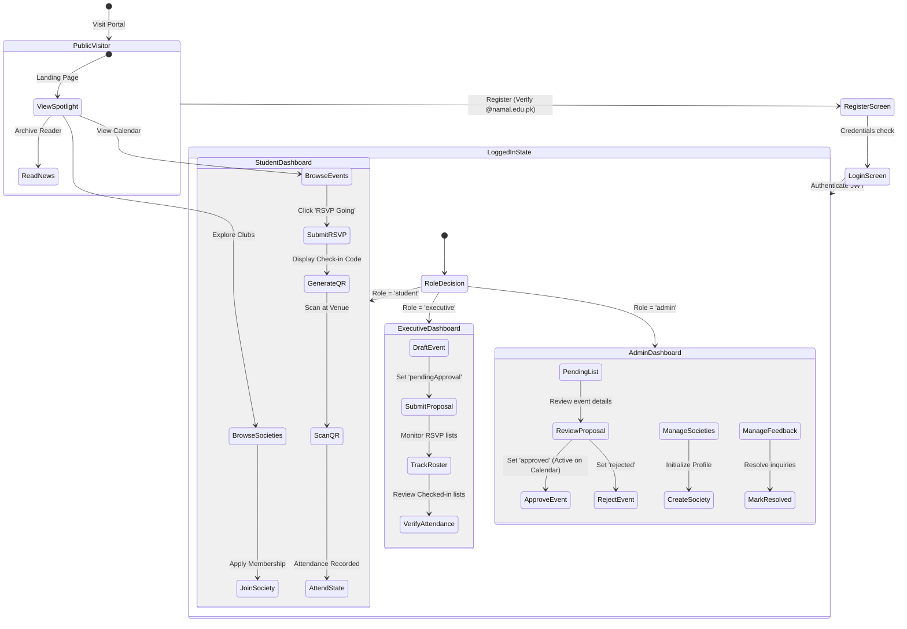

# App Flow Document
## Project: Rumi House Hub

---

## 1. Overall User Journey
The user journey of **Rumi House Hub** is designed around a cohesive path of progression. Users enter the system as anonymous **Public Visitors**, browsing active clubs and event listings. Once they register using verified Namal University credentials, they transition to **Authenticated Students** who can join societies, RSVP to activities, and check into physical venues using dynamically generated QR codes. 

Based on their credentials, student leaders can escalate to the **Society Executive** role to propose and manage events, while university authorities utilize the **Rumi Admin** control board to oversee and moderate the entire ecosystem.

---

## 2. Public Visitor Flow
An unauthenticated guest can navigate all public elements:
1. **Visit Home Page**: Views the landing hero banner showcasing the upcoming Spotlight event, reads the Rumi vision card, and can toggle accent highlights using the built-in color palette widget.
2. **Browse Societies Directory**: Views a card grid of all 6 university-wide societies and 5 internal Rumi clubs, with search filters (e.g. searching "Environmental" or filtering by "Sports").
3. **View Society Details**: Reads about the society’s coordinator, leads, executive body, and membership headcount. The "Join Society" button prompt shows a redirect modal prompting them to log in.
4. **Browse Events Calendar**: Reviews upcoming and historical campus activities. Clicking an event displays structural location data and timing. The "RSVP Now" section is masked by a login prompt.
5. **Read News**: Accesses official Rumi Newsletter archive listings to view highlight reports of campus life.
6. **Trigger Account Creation**: Navigates to the Registration or Login pages to unlock student interactions.

---

## 3. Student Flow (Authenticated)
Once authenticated, the student interface changes to support interactions:
1. **Access Student Dashboard**: Views personal profile details, joined societies list, and upcoming RSVP event dates.
2. **Submit Society Membership**: Browses the societies grid. Clicking "Join Society" submits a join request, immediately changing the card action to "Pending Member" or "Member".
3. **RSVP to Event**: Navigates the events calendar. Clicking "RSVP Going" immediately adds their name to the event's registration database list and increments the capacity counter on the UI.
4. **Generate Check-in QR**: Within the event details page, the student’s RSVP card updates to show a "View Check-in Code" button. Clicking this button dynamically generates a QR code container via the external QR API.
5. **Scan at Venue**: The student displays their generated check-in QR code to the society coordinator at the venue entrance.
6. **Manual Fallback**: If the venue scanning device cannot load the QR API, the student copies a secure 8-character code displayed under the barcode and presents it for manual entry.
7. **Verify Attendance**: Once scanned, the student dashboard dynamically shows a green "Attended" badge on their involvement timeline.

---

## 4. Society Executive Flow
Student leaders manage their society's activities through a custom dashboard:
1. **Access Executive Dashboard**: Displays quick stats (total society members, upcoming events, pending proposals).
2. **Propose Society Event**: Clicks "Propose Event" to launch a modal form. Inputs the title, description, category, venue, dates, and seat capacity limit.
3. **Await Review**: Upon submission, the event is written to the database with a status of `pendingApproval`. It is visible on the executive’s dashboard as a pending card but remains hidden from the public calendar.
4. **Monitor RSVPs**: Reviews real-time registries for approved events to check how many students have registered.
5. **Record Attendance**: At the venue, the executive reviews student QR codes, or inputs their fallback codes into the manual check-in panel to instantly record attendance.

---

## 5. Rumi Admin Flow
Administrators manage system-wide assets and event moderation:
1. **Access Admin Dashboard**: View site analytics (total users, active societies, event approvals list, and feedback messages).
2. **Moderate Event Proposals**: Displays a table of all events marked as `pendingApproval`. The admin can review details and click "Approve" (instantly publishing it to the public events calendar) or "Reject" (notifying the proposing executive).
3. **Manage Societies Directory**: Accesses tools to create new society profiles or modify executive body leadership.
4. **Publish Newsletter Articles**: Launches a post creator to write and publish summaries and highlight articles to the newsletter grid.
5. **Review Feedback Inquiries**: Reviews inquiries submitted through the contact page and marks them as "Resolved" in the database.

---

## 6. Assignment-Wise App Flow Evolution

### Assignment 1: Pure Static Navigation Flow
* **Behavior**: Links directly connect the multi-page layouts (`index.html` -> `societies.html` -> `society-detail.html` -> `events.html` -> `event-detail.html` -> `news.html`).
* **Interactions**: Button clicks use standard anchor links (`href`) or mock modal targets (hidden elements or page anchors). Clicking "RSVP" displays a static layout simulation.

### Assignment 2: Bootstrap & Dynamic DOM Manipulation
* **Behavior**: The single script file imports data from `data.json` and updates the DOM dynamically.
* **Interactions**: Toggling categories applies CSS hidden states. Modals open dynamically, and forms validate with native Bootstrap feedback. Clicking "View QR" triggers a call to the external QR Server API.

### Assignment 3: React Router Navigation SPA
* **Behavior**: Full client-side routing. Navigation occurs seamlessly without full-page reloads.
* **Interactions**: React components handle individual routing patterns. Forms send fetch requests to Express backend server endpoints, pulling dynamically from Express mock in-memory arrays.

### Assignment 4 & Final Project: Complete Database-Driven End-to-End Flow
* **Behavior**: The client SPA connects to a live Node.js backend mapped to a persistent MongoDB Atlas cluster.
* **Interactions**: Protected routes require valid JWT tokens. RSVP requests write records directly to the database, enforcing capacity limits and preventing duplicate check-ins through unique compound schema index checks.

---

## 7. Page Map
The application consists of **11 distinct page layouts**:

1. **Home (Spotlight & Feed)**: Features the Spotlight Carousel, Rumi vision introduction, and quick-read newsletter cards.
2. **Societies Directory**: Displays the search and filter panel along with the list of societies.
3. **Society Detail View**: Profile page for individual clubs showing coordinators, leads, officers, and members.
4. **Events Feed**: Lists upcoming approved activities and archives of past events.
5. **Event Detail View**: Layout showing structural timing, location, live RSVP counts, and dynamic check-in panels.
6. **Rumi Newsletter Archives**: Grid of highlight articles and reports of university life.
7. **Login Page**: Secured portal interface using email validation.
8. **Register Page**: Account creation requiring verified `@namal.edu.pk` inputs.
9. **Student Dashboard**: Personalized protected layout displaying user credentials, RSVP timeline, and membership statuses.
10. **Executive Control Board**: Dashboard for society executives to propose events, view approval statuses, and monitor rosters.
11. **Admin Control Board**: Moderation panel for event approvals, society creation, newsletter creation, and system metrics.

---

## 8. Frontend Route Map (React Router)
* `/` — Home (Public)
* `/societies` — Societies Directory (Public)
* `/societies/:slug` — Individual Society Detail View (Public)
* `/events` — Events Listing Feed (Public)
* `/events/:id` — Event Detail & RSVP Panel (Public / Authenticated Student)
* `/news` — News and Newsletter Archive Grid (Public)
* `/login` — Login Screen (Public)
* `/register` — Account Registration Form (Public)
* `/dashboard` — Student Dashboard (Protected Student)
* `/executive` — Executive Dashboard (Protected Executive)
* `/admin` — Control Board (Protected Admin Only)

---

## 9. State Flows (Dynamic Visual UI States)
* **Loading State**: Displays a custom spinner over a glassmorphic background when making backend API calls.
* **Empty State**: Renders an elegant fallback illustration and action prompt when search queries return zero results (e.g. "No approved events match your filters. Check back soon!").
* **Error State**: Displays a warm red alert banner with descriptive error details if the backend server becomes unreachable.
* **Success State**: Opens a confirmation toast with a checkmark animation upon completing successful actions (such as submitting an RSVP or registering an account).
* **Unauthorized State**: Redirects users to the login screen with a warning toast if they attempt to access protected pages without a valid JWT token.
* **Pending Approval State**: Labels proposed events with an orange "Pending Review" badge on the executive dashboard.

---

## 10. Important Edge Cases & Handling Mechanisms

1. **Unauthenticated User RSVP Attempt**:
   * *Flow*: User clicks "RSVP Going" on `/events/:id` while logged out.
   * *Handling*: The system opens a login prompt modal informing the user that registration is required, and redirects them to the `/login` route with a redirection path query parameter.
2. **Event Capacity Reached**:
   * *Flow*: A student attempts to RSVP to an event that has reached its maximum capacity.
   * *Handling*: The database registration script checks capacity limits before saving the RSVP. If full, the RSVP button is disabled and displays "Event Fully Booked," and the server returns a `400 Bad Request` block.
3. **Duplicate Check-in Attempt**:
   * *Flow*: A student attempts to check into the same venue multiple times.
   * *Handling*: The Attendance collection relies on a compound unique index of `eventId` and `userId`. Subsequent scans trigger a `499 Duplicate Check-in` error, displaying an warning prompt on the scan validator screen.
4. **Invalid QR Check-in Code**:
   * *Flow*: A student scans an outdated or invalid QR code.
   * *Handling*: The scan validator verifies the scanned event ID and check-in token against the database. If they don't match, it returns an error status and outlines the UI panel in solid red.
5. **Non-Namal Email Registration**:
   * *Flow*: A user attempts to register an account using a public email domain (e.g. `user@gmail.com`).
   * *Handling*: The registration controller blocks the request before hashing the password, returning a clear validation warning: "Only official @namal.edu.pk email addresses are permitted."
6. **Executive Event Self-Approval Block**:
   * *Flow*: A society executive attempts to approve their own proposed event.
   * *Handling*: The `/api/events/:id/status` endpoint requires a verified Admin role check, blocking requests from users with only Executive-level credentials.
7. **Backend Service Unavailable (Cold Start/Downtime)**:
   * *Flow*: The frontend React application attempts to fetch directories while the backend Render server is sleeping.
   * *Handling*: The app displays an active connection overlay notifying the user that the server is initializing, along with a fallback button to retry the connection.
8. **No Upcoming Events Available**:
   * *Flow*: A user visits the Events page when there are no scheduled events.
   * *Handling*: The system displays an empty state panel showing the official Rumi House vision statement and inviting students to browse historical events.
9. **Society Executive Proposing Events for Other Societies**:
   * *Flow*: An executive attempts to submit an event proposal for a club they do not lead.
   * *Handling*: The server verifies the executive’s ID against the society's executive body schema array before saving the proposal, blocking unauthorized requests with a `403 Forbidden` response.
10. **Student Cancelling RSVP after Check-in**:
    * *Flow*: A student attempts to cancel their RSVP after having their attendance scanned and verified.
    * *Handling*: The RSVP cancellation API checks if a matching verified Attendance document already exists. If found, the request is blocked, and the student is notified that checked-in attendance cannot be cancelled.

---

## 11. Final App Flow Summary
The **Rumi House Hub** App Flow Document provides a highly visual, logically robust mapping of the application's user experience. By outlining every page, transition, dynamic state, and edge case across all target roles, the document guarantees a smooth development process and a reliable end-user experience.
