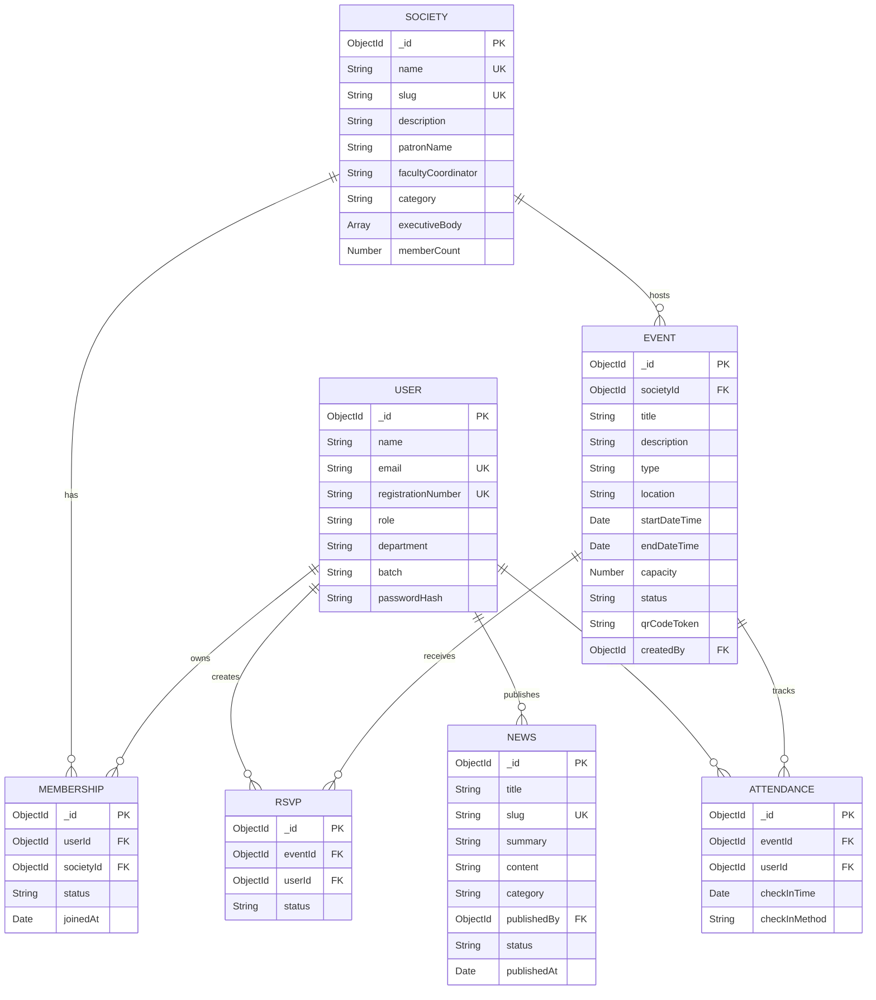

# Backend Schema Document
## Project: Rumi House Hub

---

## 1. Database Overview
The **Rumi House Hub** portal relies on a document-oriented database architecture to manage student coordination, memberships, events, and attendance records. By utilizing flexible documents, the system supports highly responsive data access, while enforcing rigid schema integrity, unique constraints, and referential validation using object data modeling.

---

## 2. Database Technology
* **Database Engine**: MongoDB Atlas (Free M0 Shared Sandbox Cluster)
* **Object Data Modeling (ODM)**: Mongoose ODM for Node.js
* **Configuration**: Connection pooling set to a maximum of 10 concurrent requests with a 30-second handshake timeout.

---

## 3. Entity Relationship Overview
The backend architecture is structured around seven relational models. Relationships are defined using object references and enforced through indexing constraints:



---

## 4. Database Models Definition

### 1. User Model (`models/User.js`)
Stores profile information, academic credentials, and permissions.
```javascript
const mongoose = require('mongoose');

const UserSchema = new mongoose.Schema({
  name: { 
    type: String, 
    required: [true, 'Name is required'],
    trim: true
  },
  email: { 
    type: String, 
    required: [true, 'Email is required'], 
    unique: true, 
    trim: true,
    lowercase: true,
    match: [/^\S+@namal\.edu\.pk$/, 'Please use a valid Namal Student Email (@namal.edu.pk)'] 
  },
  registrationNumber: { 
    type: String, 
    required: [true, 'Registration number is required'], 
    unique: true,
    trim: true,
    match: [/^NUM-[A-Z]{4}-\d{4}-\d{2,3}$/, 'Please use a valid registration number format (e.g. NUM-BSCS-2022-41)']
  },
  role: { 
    type: String, 
    enum: {
      values: ['student', 'executive', 'admin'],
      message: '{VALUE} is not a valid user role'
    }, 
    default: 'student' 
  },
  department: { 
    type: String, 
    required: [true, 'Department is required'],
    trim: true
  },
  batch: { 
    type: String, 
    required: [true, 'Batch year is required'],
    trim: true
  },
  passwordHash: { 
    type: String, 
    required: [true, 'Password hash is required'] 
  }
}, { timestamps: true });

module.exports = mongoose.model('User', UserSchema);
```

### 2. Society Model (`models/Society.js`)
Replaces static JSON catalogs with dynamic database documents.
```javascript
const SocietySchema = new mongoose.Schema({
  name: { 
    type: String, 
    required: [true, 'Society name is required'], 
    unique: true,
    trim: true 
  },
  slug: { 
    type: String, 
    required: true, 
    unique: true,
    lowercase: true
  },
  description: { 
    type: String, 
    required: [true, 'Description is required'] 
  },
  patronName: { 
    type: String, 
    required: [true, 'Patron name is required'],
    trim: true 
  },
  facultyCoordinator: { 
    type: String,
    trim: true 
  },
  category: { 
    type: String, 
    enum: ['technical', 'cultural', 'sports', 'social'], 
    required: true 
  },
  executiveBody: [{
    userId: { 
      type: mongoose.Schema.Types.ObjectId, 
      ref: 'User',
      required: true
    },
    position: { 
      type: String, 
      required: true,
      trim: true // e.g. "President", "General Secretary"
    }
  }],
  memberCount: { 
    type: Number, 
    default: 0 
  }
}, { timestamps: true });

module.exports = mongoose.model('Society', SocietySchema);
```

### 3. Membership Model (`models/Membership.js`)
Tracks student enrollment and membership statuses within clubs.
```javascript
const MembershipSchema = new mongoose.Schema({
  userId: { 
    type: mongoose.Schema.Types.ObjectId, 
    ref: 'User', 
    required: true 
  },
  societyId: { 
    type: mongoose.Schema.Types.ObjectId, 
    ref: 'Society', 
    required: true 
  },
  status: { 
    type: String, 
    enum: ['pending', 'approved', 'rejected'], 
    default: 'pending' 
  },
  joinedAt: { 
    type: Date 
  }
}, { timestamps: true });

// A user can apply for membership in a society only once
MembershipSchema.index({ userId: 1, societyId: 1 }, { unique: true });

module.exports = mongoose.model('Membership', MembershipSchema);
```

### 4. Event Model (`models/Event.js`)
Manages structural parameters for extracurricular activities.
```javascript
const EventSchema = new mongoose.Schema({
  societyId: { 
    type: mongoose.Schema.Types.ObjectId, 
    ref: 'Society', 
    required: [true, 'Hosting society reference is required'] 
  },
  title: { 
    type: String, 
    required: [true, 'Event title is required'],
    trim: true 
  },
  description: { 
    type: String, 
    required: [true, 'Event description is required'] 
  },
  type: { 
    type: String, 
    enum: ['seminar', 'workshop', 'competition', 'sports'], 
    required: true 
  },
  location: { 
    type: String, 
    required: [true, 'Venue location is required'],
    trim: true // e.g. "Main Auditorium"
  },
  startDateTime: { 
    type: Date, 
    required: [true, 'Start date and time are required'] 
  },
  endDateTime: { 
    type: Date, 
    required: [true, 'End date and time are required'] 
  },
  capacity: { 
    type: Number, 
    required: [true, 'Total event capacity is required'],
    min: [1, 'Capacity must be at least 1'] 
  },
  status: { 
    type: String, 
    enum: ['draft', 'pendingApproval', 'approved', 'rejected'], 
    default: 'pendingApproval' 
  },
  qrCodeToken: { 
    type: String, 
    required: true 
  },
  createdBy: { 
    type: mongoose.Schema.Types.ObjectId, 
    ref: 'User', 
    required: true 
  }
}, { timestamps: true });

module.exports = mongoose.model('Event', EventSchema);
```

### 5. RSVP Model (`models/RSVP.js`)
Coordinates event reservations and capacity availability.
```javascript
const RSVPSchema = new mongoose.Schema({
  eventId: { 
    type: mongoose.Schema.Types.ObjectId, 
    ref: 'Event', 
    required: true 
  },
  userId: { 
    type: mongoose.Schema.Types.ObjectId, 
    ref: 'User', 
    required: true 
  },
  status: { 
    type: String, 
    enum: ['going', 'interested', 'cancelled'], 
    default: 'going' 
  }
}, { timestamps: true });

// Compound unique index blocks duplicate RSVPs
RSVPSchema.index({ eventId: 1, userId: 1 }, { unique: true });

module.exports = mongoose.model('RSVP', RSVPSchema);
```

### 6. Attendance Model (`models/Attendance.js`)
Enforces venue entry verification and logs attendance timestamps.
```javascript
const AttendanceSchema = new mongoose.Schema({
  eventId: { 
    type: mongoose.Schema.Types.ObjectId, 
    ref: 'Event', 
    required: true 
  },
  userId: { 
    type: mongoose.Schema.Types.ObjectId, 
    ref: 'User', 
    required: true 
  },
  checkInTime: { 
    type: Date, 
    default: Date.now 
  },
  checkInMethod: { 
    type: String, 
    enum: ['qr', 'code', 'manual'], 
    default: 'qr' 
  }
});

// Enforces one check-in document per student per event
AttendanceSchema.index({ eventId: 1, userId: 1 }, { unique: true });

module.exports = mongoose.model('Attendance', AttendanceSchema);
```

### 7. News Model (`models/News.js`)
Archives reports and official publications.
```javascript
const NewsSchema = new mongoose.Schema({
  title: { 
    type: String, 
    required: [true, 'Article title is required'],
    trim: true 
  },
  slug: { 
    type: String, 
    required: true, 
    unique: true,
    lowercase: true 
  },
  summary: { 
    type: String, 
    required: [true, 'Brief summary is required'] 
  },
  content: { 
    type: String, 
    required: [true, 'Article body content is required'] 
  },
  category: { 
    type: String, 
    enum: ['newsletter', 'alert', 'visit'], 
    default: 'newsletter' 
  },
  publishedBy: { 
    type: mongoose.Schema.Types.ObjectId, 
    ref: 'User', 
    required: true 
  },
  status: { 
    type: String, 
    enum: ['draft', 'published'], 
    default: 'published' 
  },
  publishedAt: { 
    type: Date, 
    default: Date.now 
  }
}, { timestamps: true });

module.exports = mongoose.model('News', NewsSchema);
```

---

## 5. Indexing Strategy
To maintain high performance as the database scales, the following indexes must be defined:
1. **User Index**: Single field unique index on `email` and `registrationNumber` for fast lookup during login and registration.
2. **Society Index**: Single field unique index on `slug` for clean URL resolution.
3. **Compound Unique Indexes**:
   * `Membership`: `userId: 1, societyId: 1` prevents a student from applying to a society multiple times.
   * `RSVP`: `eventId: 1, userId: 1` ensures only one RSVP record exists per user per event.
   * `Attendance`: `eventId: 1, userId: 1` prevents duplicate attendance records.

---

## 6. Seed Data Requirements

### Core Societies (To be populated on initialization)
1. **Namal Environmental Club (NEC)**: Category: `social` | Patron: `Dr. Sajid`
2. **Namal Idea Club (NIC)**: Category: `technical` | Patron: `Dr. Nasir`
3. **Namal Society for Social Impact (NSSI)**: Category: `social` | Patron: `Dr. Khalid`
4. **Namal Literary & Debating Society (LDS)**: Category: `cultural` | Patron: `Prof. Amara`
5. **Namal Sports & Adventure Club (NSAC)**: Category: `sports` | Patron: `Dr. Usman`
6. **Namal Media Club (VoN)**: Category: `cultural` | Patron: `Prof. Yasir`

### Internal Rumi Clubs (To be populated on initialization)
1. **Rumi Debating Club**: Category: `cultural` | Patron: `Rumi Chief Patron`
2. **Rumi Art & Calligraphy Club**: Category: `cultural` | Patron: `Rumi Chief Patron`
3. **Rumi Reading Club**: Category: `cultural` | Patron: `Rumi Chief Patron`
4. **Rumi Décor Club**: Category: `cultural` | Patron: `Rumi Chief Patron`
5. **Rumi Writing Club**: Category: `cultural` | Patron: `Rumi Chief Patron`

---

## 7. API-to-Model Mapping
The table below displays which database collections are queried or updated by each API route:

| API Route | HTTP Method | Collections Used | Write / Read Operations |
| :--- | :--- | :--- | :--- |
| `/api/auth/register` | `POST` | `User` | **Write**: Creates a new user document. |
| `/api/auth/login` | `POST` | `User` | **Read**: Verifies email and password hash. |
| `/api/auth/me` | `GET` | `User` | **Read**: Fetches current user profile. |
| `/api/societies` | `GET` | `Society` | **Read**: Returns list of all active clubs. |
| `/api/societies` | `POST` | `Society` | **Write**: Creates a new society profile (Admin). |
| `/api/societies/:id/join` | `POST` | `Membership`, `Society` | **Write**: Creates membership, increments society member count. |
| `/api/events` | `GET` | `Event`, `Society` | **Read**: Returns list of approved events. |
| `/api/events` | `POST` | `Event` | **Write**: Proposes a new event (Society Exec). |
| `/api/events/:id/status`| `PATCH` | `Event` | **Write**: Updates event approval status (Admin). |
| `/api/events/:id/rsvp` | `POST` | `RSVP`, `Event` | **Write**: Toggles RSVP document, updates registration list. |
| `/api/events/:id/checkin`| `POST` | `Attendance`, `Event` | **Write**: Records check-in details (Student). |
| `/api/news` | `GET` | `News` | **Read**: Returns news articles list. |

---

## 8. Security Considerations
* **Password Encryption**: All password fields must be cryptographically hashed using `bcrypt` (10 rounds) before entry.
* **NoSQL Operator Sanitization**: Express middleware must sanitize input request bodies to strip out any `$` operators, preventing unauthorized query modifications (e.g. `{ "email": { "$gt": "" } }`).
* **Relational Cleanup (Cascading)**: When a society is deleted, related event, membership, and RSVP records should be cleaned up via pre-remove hooks to prevent orphaned references in the database.

---

## 9. Final Backend Schema Summary
The **Rumi House Hub** Backend Schema Document provides a detailed blueprint for the database architecture. By defining clear schemas, strict validations, unique compound indexing strategies, and precise API mappings, this document ensures the database remains robust, secure, and performant.
