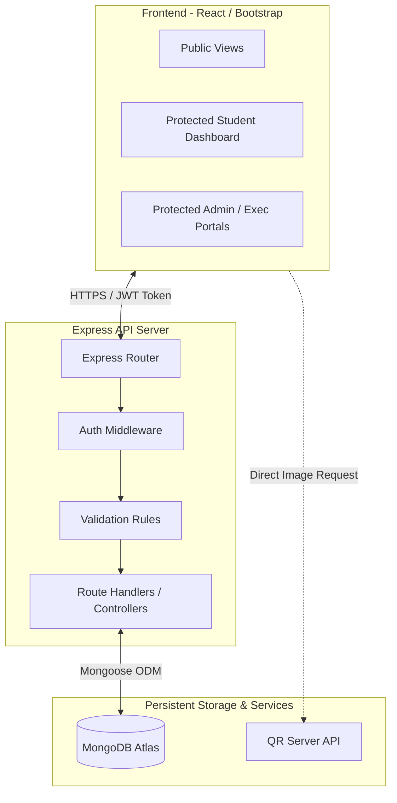

# Technical Requirements Document (TRD)
## Project: Rumi House Hub

---

## 1. Technical Overview
The **Rumi House Hub** portal is engineered as a full-stack web application designed for Namal University. It transitions systematically from a static client-side prototype into a modular, containerized, and deployed MERN stack application. The platform leverages modern web standards, role-based JWT authentication, a persistent document database, and external QR-code generation APIs to automate campus activity coordination.

---

## 2. Technology Stack by Assignment Phase

### Assignment 1: Pure HTML5 & CSS3 Layout (Lectures 1–5)
* **Markup**: Semantic HTML5 tags (`<header>`, `<nav>`, `<main>`, `<section>`, `<article>`, `<footer>`, `<video>`, `<audio>`).
* **Styling**: Vanilla CSS3, custom HSL CSS custom properties (variables) for design tokens, flexbox/grid layout models.
* **Responsiveness**: Pure CSS media queries (`@media`) targeting mobile, tablet, and desktop breakpoints without third-party frameworks.

### Assignment 2: Bootstrap 5 & Vanilla JavaScript ES6 (Lectures 6–11)
* **UI Framework**: Bootstrap 5.3 (via CDN) utilizing grid containers, responsive flex utilities, modals, forms, and alerts.
* **Client-side Logic**: Vanilla JavaScript ES6+ (Arrow functions, event listeners, DOM manipulation, asynchronous `fetch`).
* **Mock Database**: Local static `data.json` storing society information.
* **Integrations**: Client-side fetch calls to the external **QR Server API**.

### Assignment 3: React SPA & Node.js/Express Memory Server (Lectures 12–22)
* **Frontend SPA**: React 18+ bootstrapped with Vite, client-side routing via React Router DOM.
* **Backend Runtime**: Node.js environment.
* **Web Framework**: Express.js server utilizing CORS middleware.
* **Data Storage**: In-memory JavaScript arrays representing backend collections (no database engine yet).

### Assignment 4 & Final Project: Persistent full MERN Stack (Lectures 23–30)
* **Persistent Database**: MongoDB Atlas (Free M0 Shared Sandbox Cluster).
* **Object Modeling**: Mongoose ODM with schemas, field validators, pre-save hooks, and compound indexes.
* **Security & Auth**: JWT (JSON Web Tokens) with a header-based Bearer token strategy, password hashing via `bcryptjs`.
* **Deployment targets**: Frontend hosted on Vercel/Netlify, Backend server hosted on Render/Railway.

---

## 3. System Architecture
The application features a decoupled, multi-tiered architecture:



1. **Client Tier**: A dynamic React single-page application. Handles routing, captures user input, holds local states, and validates client fields before sending API requests.
2. **Application Tier**: Node.js running an Express server. Exposes secure RESTful JSON routes, validates session tokens, checks user roles, handles errors, and routes data.
3. **Database Tier**: MongoDB Atlas host. Stores documents in indexed collections.
4. **External Services**: QR Server API called by the client using a secure database token to dynamically draw attendance barcodes.

---

## 4. Directory structures

### Assignment 1 Folder Structure
```text
Assignment-1/
├── index.html                   # Spotlight & Vision
├── societies.html               # Grid of 5 Rumi clubs & 6 societies
├── society-detail.html          # Individual profile
├── events.html                  # Timeline & filters
├── event-detail.html            # Event specifications & RSVP panel
├── news.html                    # Newsletter lists
├── styles.css                   # Layout properties & variables
└── media/                       # Image and multimedia assets
```

### Assignment 2 Folder Structure
```text
Assignment-2/
├── index.html                   # Upgraded layouts with Bootstrap 5
├── style.css                    # Namal palette overrides
├── script.js                    # DOM manipulation, form validation, QR API
├── data.json                    # Local mockup data
└── media/                       # Brand and background graphics
```

### Assignment 3 React + Backend Structure
```text
Rumi-House-Hub-A3/
├── backend/
│   ├── package.json
│   └── server.js                # Express logic & in-memory dataset
└── frontend/
    ├── package.json
    ├── index.html
    ├── vite.config.js
    └── src/
        ├── components/          # Navbar, Footer, Cards, ProtectedRoute
        ├── pages/               # Home, Societies, Events, Dashboards
        ├── App.jsx              # Routing configurations
        └── main.jsx
```

### Final Project Production Structure
```text
Rumi-House-Hub/
├── backend/
│   ├── config/
│   │   └── db.js                # MongoDB connection handler
│   ├── middleware/
│   │   ├── authMiddleware.js    # JWT verify & roles checker
│   │   └── errorMiddleware.js   # Global exception interceptor
│   ├── models/
│   │   ├── User.js
│   │   ├── Society.js
│   │   ├── Membership.js
│   │   ├── Event.js
│   │   ├── RSVP.js
│   │   ├── Attendance.js
│   │   └── News.js
│   ├── controllers/             # Express handlers
│   ├── routes/                  # API endpoints definition
│   ├── server.js                # System main assembly
│   ├── package.json
│   └── .env                     # Server environment settings
└── frontend/
    ├── package.json
    ├── vite.config.js
    ├── .env                     # Client API target host configurations
    └── src/
        ├── components/          # Reusable UI parts
        ├── pages/               # Application page screens
        ├── context/             # Auth global state store
        ├── App.jsx              # Main routing & themes
        └── main.jsx
```

---

## 5. Environment Variables
To ensure environment isolation and prevent credential leaks, the application requires the configuration of the following parameters:

### Backend `.env`
* `PORT`: Port number for the backend application (default `5000`).
* `MONGODB_URI`: Complete connection string to access the MongoDB Atlas collection (e.g. `mongodb+srv://<user>:<password>@cluster.mongodb.net/rumihub`).
* `JWT_SECRET`: High-entropy secret key used to sign and verify JSON Web Tokens (e.g. `rumi_secure_jwt_session_token_key_2026_xyz`).

### Frontend `.env`
* `VITE_API_URL`: Root path target for making backend API calls.
  * *Development*: `http://localhost:5000`
  * *Production*: Deployed backend domain (e.g. `https://rumi-hub-backend.onrender.com`)

---

## 6. API Architecture (RESTful Routes Map)
The server exposes structured HTTP endpoints to handle transactions. All routes return structured JSON responses.

| Method | Endpoint | Authorization | Description |
| :--- | :--- | :--- | :--- |
| `POST` | `/api/auth/register` | Public | Hash credentials, validate email, create User document. |
| `POST` | `/api/auth/login` | Public | Authenticate password, return user role & JWT token. |
| `GET` | `/api/auth/me` | Logged Student | Retrieve current authenticated user’s profile data. |
| `GET` | `/api/societies` | Public | Fetch all societies. Supports name search and category filter. |
| `POST` | `/api/societies` | Rumi Admin | Create a new society profile document. |
| `POST` | `/api/societies/:id/join` | Logged Student | Apply to join a society; creates a Membership record. |
| `GET` | `/api/events` | Public | Fetch all events with status `approved` for the calendar. |
| `POST` | `/api/events` | Society Exec | Create a new event draft (defaults to `pendingApproval`). |
| `PATCH` | `/api/events/:id/status`| Rumi Admin | Accept/reject a proposed event, updating status value. |
| `POST` | `/api/events/:id/rsvp` | Logged Student | Add/modify RSVP status (`going`, `interested`, `cancelled`). |
| `POST` | `/api/events/:id/checkin`| Logged Student | Scan unique token, verify conditions, record Attendance. |
| `GET` | `/api/news` | Public | Fetch all active news articles and newsletter documents. |
| `POST` | `/api/news` | Rumi Admin | Write and publish a new newsletter article. |

---

## 7. Authentication Requirements
* **Registration**: Receives user inputs. Passwords must be run through `bcryptjs` with a cost factor of `10` rounds before database entry.
* **Authentication**: Verifies login email and compares entered values with database hash values. If correct, returns a signed JWT token containing user details (`_id`, `email`, `role`).
* **Route Protection**: Incoming requests to secure routes must provide a `Bearer <token>` in the HTTP `Authorization` header. Custom Express middleware extracts and verifies the token signature.
* **Token Expiration**: Signed tokens will have an expiration window of `24h` to maintain student session lifecycles safely.

---

## 8. Authorization Matrix
The system enforces authorization restrictions using role checking inside backend route middleware:

```javascript
// Middleware structure inside backend/middleware/authMiddleware.js
const authorizeRoles = (...allowedRoles) => {
  return (req, res, next) => {
    if (!req.user || !allowedRoles.includes(req.user.role)) {
      return res.status(403).json({ message: 'Forbidden: Insufficient privileges' });
    }
    next();
  };
};
```

Access permissions map:
* **Public Route Access**: `/api/auth/register`, `/api/auth/login`, `/api/societies` (GET), `/api/events` (GET), `/api/news` (GET).
* **Logged Student**: All public actions, plus joining societies (`/api/societies/:id/join`), RSVPing to events (`/api/events/:id/rsvp`), and self check-in (`/api/events/:id/checkin`).
* **Society Executive**: All student actions, plus creating events for their society (`/api/events` POST) and reading their society’s event RSVP lists.
* **Rumi Admin**: Complete administrative control, including creating societies, approving/rejecting events, managing news entries, and viewing system-wide analytics.

---

## 9. External API Integration (QR Server)
To support contact-free venue check-in verification without importing heavy local generation packages, the client integration calls the public QR Server API:

* **Endpoint**: `https://api.qrserver.com/v1/create-qr-code/`
* **Format**: GET request parameters specifying image size and the text payload.
* **Payload Generation**:
  ```javascript
  const qrSize = "200x200";
  // The payload contains the event database id and the logged student's secure unique token
  const qrData = encodeURIComponent(`eventId=${eventId}&token=${userSecureToken}`);
  const qrUrl = `https://api.qrserver.com/v1/create-qr-code/?size=${qrSize}&data=${qrData}`;
  ```
* **Fallback Behavior**: If the client is unable to fetch the external QR generator, the page displays a human-readable 8-digit secure code underneath the QR placeholder container (e.g. `RUMI-8893-X`). Students can provide this text token to the venue executive to be entered manually.

---

## 10. Validation Requirements
* **Email Constraints**: Must be validated on both the client side (regex) and database schema level using:
  ```regex
  /^\S+@namal\.edu\.pk$/
  ```
  Any domain other than `@namal.edu.pk` is rejected.
* **Registration Format**: Student registration numbers must follow the official Namal format:
  ```regex
  /^NUM-[A-Z]{4}-\d{4}-\d{2,3}$/   // Matches e.g. "NUM-BSCS-2022-41"
  ```
* **Attendance Prevention**: The Attendance schema must define a compound index on `eventId` and `userId` with a `unique: true` constraint. This programmatic validation prevents a student from scanning their check-in code multiple times to record duplicate attendance.

---

## 11. Error Handling Requirements
* **Express Interceptor**: A global centralized error handler middleware must be active to capture syntax errors, schema validations, and MongoDB exceptions.
* **JSON Structure**: Standard response format for API exceptions:
  ```json
  {
    "status": "error",
    "message": "Detailed developer message or simplified client warning",
    "stack": "Included only in development environment configs"
  }
  ```
* **Client Handlers**: The React app must catch exceptions in API requests and display user-friendly visual alert banners instead of breaking the browser interface.

---

## 12. Security Requirements
* **Input Sanitization**: Use Express sanitizers to protect backend schemas from NoSQL operators.
* **CORS policy**: Restrict frontend origins in production server headers using appropriate middleware.
* **HTTP Security Headers**: Set standard headers (e.g. using `helmet`) to prevent clickjacking and related cross-site script execution threats.

---

## 13. Deployment Requirements
* **Database (MongoDB Atlas)**: Configured with network firewall entries set to `0.0.0.0/0` during runtime to handle dynamic container hosting addresses.
* **Backend Hosting (Render/Railway)**: Configured to support automatic builds on repository commits. Must support dynamic binding to `process.env.PORT`.
* **Frontend Hosting (Vercel/Netlify)**: Must support single-page routing redirects via a `vercel.json` or `_redirects` configuration file to prevent page-reload 404 errors during client-side route navigation.

---

## 14. Testing Requirements
* **Unit Testing**: Route controller validation using Postman collection profiles or Jest mock suites.
* **Role Verification**: Automated checks trying to write to admin routes with a student JWT to verify that the server returns a correct `403 Forbidden` response.
* **Responsive Layout Testing**: Browser dev-tools viewport scaling to ensure perfect flow adaptability from 375px (mobile) to 1440px (desktop viewports).

---

## 15. Technical Risks & Mitigations
* **Risk (Cold Starts)**: Hosting the Express server on a free Render tier may result in initial service wake-up delays (up to 50 seconds) when inactive.
  * *Mitigation*: The React application displays an dynamic loading overlay with descriptive status text ("Waking up server, this may take a few seconds...") upon detecting the initial API handshakes.
* **Risk (Database Access)**: Network IP blocks or sandbox size capacity exhaust.
  * *Mitigation*: Establish programmatic monitoring logs and set connection timeouts in the mongoose database setup file.

---

## 16. Final TRD Summary
The **Rumi House Hub** Technical Requirements Document establishes a highly structured, scalable, and secure architecture. By mapping each milestone's stack requirements to a production-grade full-stack architecture, the TRD serves as a detailed blueprint for a high-quality implementation.
